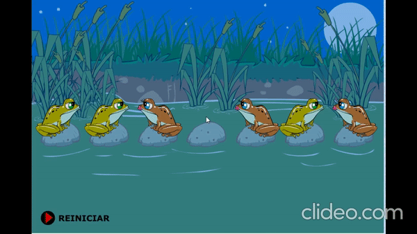

# IA

Inteligencia Artificial

- Métodos de busqueda

  - Problema del arriero anchura y profundidad ([Referencia](https://users.dcc.uchile.cl/~abassi/52a/material/c5.html)) ([Video](https://www.youtube.com/watch?v=Lp-nuB0k5Sg))
    
  - Problema del agente viajero anchura y profundidad ([Referencia](https://www.uaeh.edu.mx/scige/boletin/tlahuelilpan/n3/e5.html))
  - Problema de las ranas saltarinas anchura y profundidad (N Ranas) ([Video](https://www.youtube.com/watch?v=reJ2_UqKbp8))
    

- Neuronal Network

  - Red neuronal en Java ([Paso a paso backpropagation](https://mattmazur.com/2015/03/17/a-step-by-step-backpropagation-example/))
    - Iris
    - Cangrejos
    - Compuertas Logicas
    - Digitos

- ShapeDetection
  - Implementación de [OpenIMAJ](http://openimaj.org/) para detección de figuras geométricas

    - Cuadro
    - Círculo
    - Pentágono
    - Triángulo

**Nota 1:**
La clase por **MC. Idarth Claudio Matadamas Ortiz** en **INSTITUTO TECNOLÓGICO DE OAXACA**
